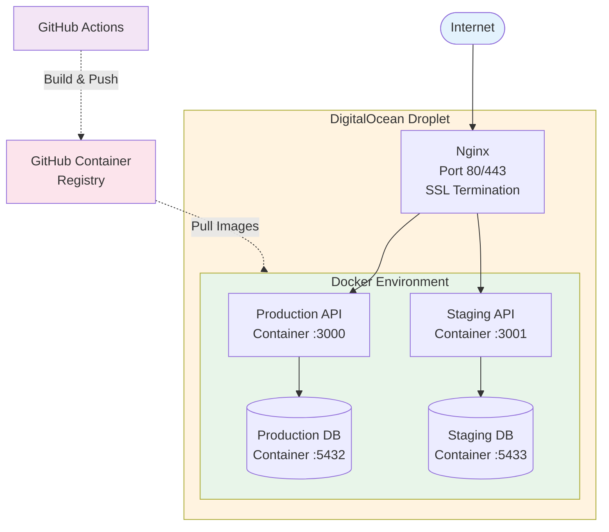

# Deployment Guide

Complete guide for deploying Life Assistant to production with Docker, CI/CD, and staging environments.

## Table of Contents

- [Architecture Overview](#architecture-overview)
- [Prerequisites](#prerequisites)
- [Phase 1: Server Setup](#phase-1-server-setup)
- [Phase 2: Environment Configuration](#phase-2-environment-configuration)
- [Phase 3: Docker Compose Setup](#phase-3-docker-compose-setup)
- [Phase 4: GitHub Container Registry](#phase-4-github-container-registry)
- [Phase 5: CI/CD Pipeline](#phase-5-cicd-pipeline)
- [Phase 6: Nginx Configuration](#phase-6-nginx-configuration)
- [Phase 7: SSL Setup](#phase-7-ssl-setup)
- [Phase 8: Initial Deployment](#phase-8-initial-deployment)
- [Phase 9: Rollback Strategy](#phase-9-rollback-strategy)
- [Phase 10: Monitoring & Maintenance](#phase-10-monitoring--maintenance)
- [Troubleshooting](#troubleshooting)

---

## Architecture Overview



**Components:**
- **Nginx**: Reverse proxy, SSL termination, load balancing
- **Docker**: Container runtime for isolation and consistency
- **PostgreSQL**: Dedicated database containers for prod/staging
- **GitHub Actions**: Automated CI/CD pipeline
- **GitHub Container Registry**: Docker image storage

---

## Prerequisites

- DigitalOcean Droplet (or any VPS)
  - Ubuntu 22.04 LTS or newer
  - Minimum: 2 GB RAM, 2 vCPUs, 50 GB disk
  - Recommended: 4 GB RAM, 2 vCPUs, 80 GB disk
- Domain name with DNS configured
  - `yourdomain.com` → Production
  - `staging.yourdomain.com` → Staging
- GitHub account with repo admin access
- SSH access to your server

---

## Phase 1: Server Setup

### 1.1 Install Docker

SSH into your server and run:

```bash
# Update system
sudo apt update && sudo apt upgrade -y

# Install Docker
curl -fsSL https://get.docker.com -o get-docker.sh
sudo sh get-docker.sh

# Verify installation
docker --version

# Add your user to docker group
sudo usermod -aG docker $USER
newgrp docker

# Test Docker
docker run hello-world
```

### 1.2 Install Docker Compose

```bash
# Verify Docker Compose is installed
docker compose version

# If not installed:
sudo apt install -y docker-compose-plugin
```

### 1.3 Create Directory Structure

```bash
# Create application directories
sudo mkdir -p /var/www/life-assistant/{production,staging,shared,backups}
sudo chown -R $USER:$USER /var/www/life-assistant

# Navigate to directory
cd /var/www/life-assistant
```

---

## Phase 2: Environment Configuration

### 2.1 Create Production Environment File

```bash
nano /var/www/life-assistant/shared/.env.production
```

**Contents:**
```env
# GitHub Container Registry
GITHUB_USERNAME=your-github-username

# Application
NODE_ENV=production
PORT=3000

# Database
DATABASE_HOST=postgres
DATABASE_PORT=5432
DATABASE_USERNAME=life_app
DATABASE_PASSWORD=CHANGE_ME_SECURE_PASSWORD
DATABASE_NAME=life_assistant

# Wrike Integration
WRIKE_TOKEN=your_wrike_token_here

# ClickUp Integration
CLICKUP_TOKEN=your_clickup_token_here
CLICKUP_WORKSPACE_ID=your_workspace_id
CLICKUP_LIST_ID=your_list_id
```

**Generate secure database password:**
```bash
openssl rand -base64 32
```

### 2.2 Create Staging Environment File

```bash
nano /var/www/life-assistant/shared/.env.staging
```

**Contents:**
```env
# GitHub Container Registry
GITHUB_USERNAME=your-github-username

# Application
NODE_ENV=staging
PORT=3000

# Database
DATABASE_HOST=postgres
DATABASE_PORT=5432
DATABASE_USERNAME=life_app_staging
DATABASE_PASSWORD=DIFFERENT_SECURE_PASSWORD
DATABASE_NAME=life_assistant_staging

# Wrike Integration
WRIKE_TOKEN=your_wrike_token_here

# ClickUp Integration
CLICKUP_TOKEN=your_clickup_token_here
CLICKUP_WORKSPACE_ID=your_workspace_id
CLICKUP_LIST_ID=your_staging_list_id
```

### 2.3 Secure Environment Files

```bash
# Make env files readable only by owner
chmod 600 /var/www/life-assistant/shared/.env.*

# Verify permissions
ls -la /var/www/life-assistant/shared/
```

---

## Phase 3: Docker Compose Setup

### 3.1 Production Docker Compose

Create `/var/www/life-assistant/production/docker-compose.yml`:

```yaml
version: '3.8'

services:
  postgres:
    image: postgres:18-alpine
    container_name: life-assistant-db-prod
    restart: unless-stopped
    environment:
      POSTGRES_USER: ${DATABASE_USERNAME}
      POSTGRES_PASSWORD: ${DATABASE_PASSWORD}
      POSTGRES_DB: ${DATABASE_NAME}
    volumes:
      - postgres_data:/var/lib/postgresql/data
    networks:
      - life-assistant-prod
    healthcheck:
      test: ['CMD-SHELL', 'pg_isready -U ${DATABASE_USERNAME}']
      interval: 10s
      timeout: 5s
      retries: 5

  api:
    image: ghcr.io/YOUR_GITHUB_USERNAME/life-assistant:latest
    container_name: life-assistant-api-prod
    restart: unless-stopped
    ports:
      - '127.0.0.1:3000:3000'
    env_file:
      - ../shared/.env.production
    depends_on:
      postgres:
        condition: service_healthy
    networks:
      - life-assistant-prod
    healthcheck:
      test: ['CMD', 'wget', '--quiet', '--tries=1', '--spider', 'http://localhost:3000/health']
      interval: 30s
      timeout: 10s
      retries: 3

volumes:
  postgres_data:

networks:
  life-assistant-prod:
    driver: bridge
```

**Note:** Replace `YOUR_GITHUB_USERNAME` with your actual GitHub username.

### 3.2 Staging Docker Compose

Create `/var/www/life-assistant/staging/docker-compose.yml`:

```yaml
version: '3.8'

services:
  postgres:
    image: postgres:18-alpine
    container_name: life-assistant-db-staging
    restart: unless-stopped
    environment:
      POSTGRES_USER: ${DATABASE_USERNAME}
      POSTGRES_PASSWORD: ${DATABASE_PASSWORD}
      POSTGRES_DB: ${DATABASE_NAME}
    ports:
      - '127.0.0.1:5433:5432'
    volumes:
      - postgres_data_staging:/var/lib/postgresql/data
    networks:
      - life-assistant-staging
    healthcheck:
      test: ['CMD-SHELL', 'pg_isready -U ${DATABASE_USERNAME}']
      interval: 10s
      timeout: 5s
      retries: 5

  api:
    image: ghcr.io/YOUR_GITHUB_USERNAME/life-assistant:staging
    container_name: life-assistant-api-staging
    restart: unless-stopped
    ports:
      - '127.0.0.1:3001:3000'
    env_file:
      - ../shared/.env.staging
    depends_on:
      postgres:
        condition: service_healthy
    networks:
      - life-assistant-staging
    healthcheck:
      test: ['CMD', 'wget', '--quiet', '--tries=1', '--spider', 'http://localhost:3000/health']
      interval: 30s
      timeout: 10s
      retries: 3

volumes:
  postgres_data_staging:

networks:
  life-assistant-staging:
    driver: bridge
```

---

## Phase 4: GitHub Container Registry

### 4.1 Enable GitHub Container Registry

1. Go to GitHub repo → Settings → Actions → General
2. Scroll to "Workflow permissions"
3. Select "Read and write permissions"
4. Check "Allow GitHub Actions to create and approve pull requests"
5. Save

### 4.2 Generate SSH Deploy Key

**On your local machine:**
```bash
# Generate SSH key (use project-specific name for shared VPS)
ssh-keygen -t ed25519 -C "life-assistant-deploy" -f ~/.ssh/life-assistant-deploy

# Display private key (copy to GitHub secret)
cat ~/.ssh/life-assistant-deploy

# Display public key (add to server)
cat ~/.ssh/life-assistant-deploy.pub
```

**On your server:**
```bash
# Add public key
mkdir -p ~/.ssh
nano ~/.ssh/authorized_keys
# Paste the public key

# Set permissions
chmod 700 ~/.ssh
chmod 600 ~/.ssh/authorized_keys
```

### 4.3 Add GitHub Secrets

Go to: GitHub repo → Settings → Secrets and variables → Actions

Add these secrets:

| Secret Name | Value |
|------------|-------|
| `SSH_HOST` | Your server IP address |
| `SSH_USER` | Your server username |
| `SSH_PRIVATE_KEY` | Contents of `~/.ssh/github_deploy` |

---

## Phase 5: CI/CD Pipeline

### 5.1 Create GitHub Actions Workflow

Create `.github/workflows/deploy.yml`:

```yaml
name: Build and Deploy

on:
  push:
    branches:
      - main      # Production
      - staging   # Staging

env:
  REGISTRY: ghcr.io
  IMAGE_NAME: ${{ github.repository_owner }}/life-assistant

jobs:
  build-and-push:
    runs-on: ubuntu-latest
    permissions:
      contents: read
      packages: write

    steps:
      - name: Checkout code
        uses: actions/checkout@v4

      - name: Set up Docker Buildx
        uses: docker/setup-buildx-action@v3

      - name: Log in to GitHub Container Registry
        uses: docker/login-action@v3
        with:
          registry: ${{ env.REGISTRY }}
          username: ${{ github.actor }}
          password: ${{ secrets.GITHUB_TOKEN }}

      - name: Extract metadata
        id: meta
        uses: docker/metadata-action@v5
        with:
          images: ${{ env.REGISTRY }}/${{ env.IMAGE_NAME }}
          tags: |
            type=ref,event=branch
            type=sha,prefix={{branch}}-
            type=raw,value=latest,enable=${{ github.ref == 'refs/heads/main' }}
            type=raw,value=staging,enable=${{ github.ref == 'refs/heads/staging' }}

      - name: Build and push Docker image
        uses: docker/build-push-action@v5
        with:
          context: ./life-assistant-api
          file: ./life-assistant-api/Dockerfile
          push: true
          tags: ${{ steps.meta.outputs.tags }}
          labels: ${{ steps.meta.outputs.labels }}
          cache-from: type=gha
          cache-to: type=gha,mode=max

  deploy:
    needs: build-and-push
    runs-on: ubuntu-latest

    steps:
      - name: Determine environment
        id: env
        run: |
          if [[ "${{ github.ref }}" == "refs/heads/main" ]]; then
            echo "environment=production" >> $GITHUB_OUTPUT
          else
            echo "environment=staging" >> $GITHUB_OUTPUT
          fi

      - name: Deploy to server
        uses: appleboy/ssh-action@v1.0.3
        with:
          host: ${{ secrets.SSH_HOST }}
          username: ${{ secrets.SSH_USER }}
          key: ${{ secrets.SSH_PRIVATE_KEY }}
          script: |
            cd /var/www/life-assistant/${{ steps.env.outputs.environment }}

            docker compose pull
            docker compose up -d
            docker compose exec -T api npm run migration:run || true
            docker image prune -af --filter "until=24h"
            docker compose ps
```

---

## Phase 6: Nginx Configuration

### 6.1 Production Config

Create `/etc/nginx/sites-available/life-assistant-production`:

```nginx
server {
    listen 80;
    server_name yourdomain.com;
    return 301 https://$server_name$request_uri;
}

server {
    listen 443 ssl http2;
    server_name yourdomain.com;

    ssl_certificate /etc/letsencrypt/live/yourdomain.com/fullchain.pem;
    ssl_certificate_key /etc/letsencrypt/live/yourdomain.com/privkey.pem;

    ssl_protocols TLSv1.2 TLSv1.3;
    ssl_ciphers HIGH:!aNULL:!MD5;
    ssl_prefer_server_ciphers on;

    add_header Strict-Transport-Security "max-age=31536000" always;

    location / {
        proxy_pass http://127.0.0.1:3000;
        proxy_http_version 1.1;
        proxy_set_header Upgrade $http_upgrade;
        proxy_set_header Connection 'upgrade';
        proxy_set_header Host $host;
        proxy_cache_bypass $http_upgrade;
        proxy_set_header X-Real-IP $remote_addr;
        proxy_set_header X-Forwarded-For $proxy_add_x_forwarded_for;
        proxy_set_header X-Forwarded-Proto $scheme;
    }

    location /health {
        proxy_pass http://127.0.0.1:3000/health;
        access_log off;
    }
}
```

### 6.2 Staging Config

Create `/etc/nginx/sites-available/life-assistant-staging`:

```nginx
server {
    listen 80;
    server_name staging.yourdomain.com;
    return 301 https://$server_name$request_uri;
}

server {
    listen 443 ssl http2;
    server_name staging.yourdomain.com;

    ssl_certificate /etc/letsencrypt/live/staging.yourdomain.com/fullchain.pem;
    ssl_certificate_key /etc/letsencrypt/live/staging.yourdomain.com/privkey.pem;

    ssl_protocols TLSv1.2 TLSv1.3;
    ssl_ciphers HIGH:!aNULL:!MD5;

    location / {
        proxy_pass http://127.0.0.1:3001;
        proxy_http_version 1.1;
        proxy_set_header Upgrade $http_upgrade;
        proxy_set_header Connection 'upgrade';
        proxy_set_header Host $host;
        proxy_cache_bypass $http_upgrade;
        proxy_set_header X-Real-IP $remote_addr;
        proxy_set_header X-Forwarded-For $proxy_add_x_forwarded_for;
        proxy_set_header X-Forwarded-Proto $scheme;
    }
}
```

### 6.3 Enable Sites

```bash
sudo ln -sf /etc/nginx/sites-available/life-assistant-production /etc/nginx/sites-enabled/
sudo ln -sf /etc/nginx/sites-available/life-assistant-staging /etc/nginx/sites-enabled/
sudo nginx -t
sudo systemctl reload nginx
```

---

## Phase 7: SSL Setup

### 7.1 Install Certbot

```bash
sudo apt install -y certbot python3-certbot-nginx
```

### 7.2 Obtain Certificates

```bash
# Production
sudo certbot --nginx -d yourdomain.com

# Staging
sudo certbot --nginx -d staging.yourdomain.com
```

### 7.3 Verify Auto-Renewal

```bash
sudo certbot renew --dry-run
sudo systemctl status certbot.timer
```

---

## Phase 8: Initial Deployment

### 8.1 Manual First Deploy

**Production:**
```bash
cd /var/www/life-assistant/production
docker compose pull
docker compose up -d
docker compose logs -f
docker compose exec api npm run migration:run
```

**Staging:**
```bash
cd /var/www/life-assistant/staging
docker compose pull
docker compose up -d
docker compose logs -f
docker compose exec api npm run migration:run
```

### 8.2 Verify Deployment

```bash
# Check containers
docker ps

# Test health endpoints
curl http://localhost:3000/health
curl http://localhost:3001/health

# Test via domain
curl https://yourdomain.com/health
curl https://staging.yourdomain.com/health
```

---

## Phase 9: Rollback Strategy

### 9.1 Quick Rollback Script

Create `/var/www/life-assistant/rollback.sh`:

```bash
#!/bin/bash

ENV=${1:-production}
VERSION=${2}

if [ -z "$VERSION" ]; then
    echo "Usage: ./rollback.sh [production|staging] <version>"
    echo "Example: ./rollback.sh production main-abc1234"
    exit 1
fi

cd /var/www/life-assistant/$ENV

sed -i "s|ghcr.io/.*/life-assistant:.*|ghcr.io/YOUR_USERNAME/life-assistant:$VERSION|" docker-compose.yml

docker compose pull
docker compose up -d

echo "Rolled back $ENV to version $VERSION"
docker compose ps
```

```bash
chmod +x /var/www/life-assistant/rollback.sh
```

### 9.2 Usage

```bash
# List available versions
docker images ghcr.io/YOUR_USERNAME/life-assistant

# Rollback production
./rollback.sh production main-abc1234

# Rollback staging
./rollback.sh staging staging-xyz789
```

---

## Phase 10: Monitoring & Maintenance

### 10.1 View Logs

```bash
# Real-time logs
docker compose -f /var/www/life-assistant/production/docker-compose.yml logs -f

# Last 100 lines
docker compose logs --tail=100 api

# Specific service
docker compose logs -f postgres
```

### 10.2 Database Backup

Create `/var/www/life-assistant/backup-db.sh`:

```bash
#!/bin/bash

ENV=${1:-production}
BACKUP_DIR="/var/www/life-assistant/backups"
DATE=$(date +%Y%m%d_%H%M%S)

mkdir -p $BACKUP_DIR

docker compose -f /var/www/life-assistant/$ENV/docker-compose.yml exec -T postgres \
    pg_dump -U life_app life_assistant | gzip > $BACKUP_DIR/${ENV}_db_${DATE}.sql.gz

find $BACKUP_DIR -name "${ENV}_db_*.sql.gz" -mtime +7 -delete

echo "Backup: $BACKUP_DIR/${ENV}_db_${DATE}.sql.gz"
```

```bash
chmod +x /var/www/life-assistant/backup-db.sh

# Add to crontab
crontab -e
# Add: 0 2 * * * /var/www/life-assistant/backup-db.sh production
```

### 10.3 Health Check Script

Create `/var/www/life-assistant/health-check.sh`:

```bash
#!/bin/bash

check_service() {
    if curl -sf http://localhost:$2/health > /dev/null; then
        echo "✅ $1 is healthy"
    else
        echo "❌ $1 is DOWN"
    fi
}

check_service "Production" 3000
check_service "Staging" 3001
```

### 10.4 Resource Monitoring

```bash
# Container stats
docker stats

# Disk usage
docker system df

# Clean up
docker system prune -a --volumes
```

---

## Troubleshooting

### Container Won't Start

```bash
# Check logs
docker compose logs api

# Check environment variables
docker compose config

# Verify database connection
docker compose exec api env | grep DATABASE
```

### Database Connection Issues

```bash
# Check postgres is running
docker ps | grep postgres

# Test connection
docker compose exec postgres psql -U life_app life_assistant

# Reset database (CAUTION)
docker compose down -v
docker compose up -d
```

### SSL Certificate Issues

```bash
# Check certificate status
sudo certbot certificates

# Renew manually
sudo certbot renew --force-renewal

# Check nginx config
sudo nginx -t
```

### Deployment Not Updating

```bash
# Force pull latest image
docker compose pull --ignore-pull-failures
docker compose down
docker compose up -d

# Clear all images
docker image prune -a
```

---

## Quick Reference

```bash
# View running containers
docker ps

# View logs
docker compose logs -f

# Restart service
docker compose restart api

# Update to latest
docker compose pull && docker compose up -d

# Access database
docker compose exec postgres psql -U life_app life_assistant

# Run migrations
docker compose exec api npm run migration:run

# Rollback
./rollback.sh production main-abc1234

# Backup database
./backup-db.sh production

# Health check
./health-check.sh
```

---

## Deployment Workflow

**Development → Production:**

1. Create feature branch
2. Open PR to `staging`
3. Merge → Auto-deploys to staging.yourdomain.com
4. Test on staging
5. Merge `staging` → `main`
6. Auto-deploys to yourdomain.com

**Rollback if needed:**
```bash
./rollback.sh production <previous-version>
```

---

For architectural details, see [DESIGN.md](./DESIGN.md).
