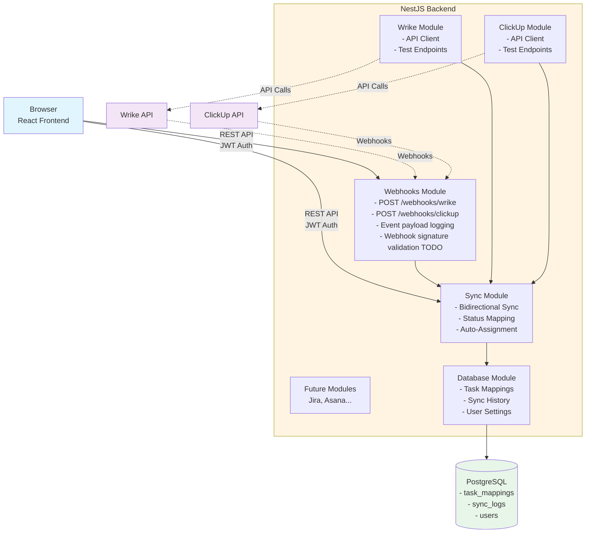
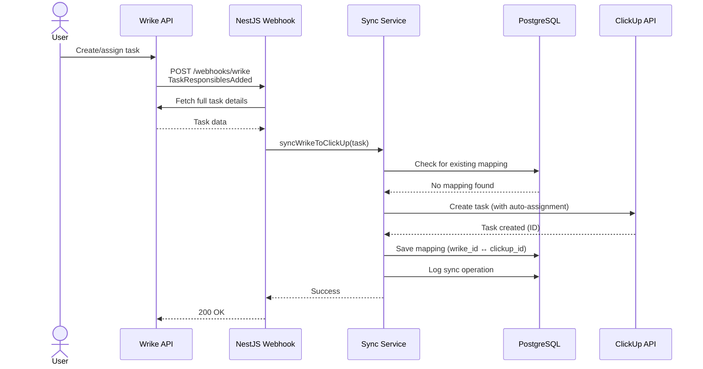
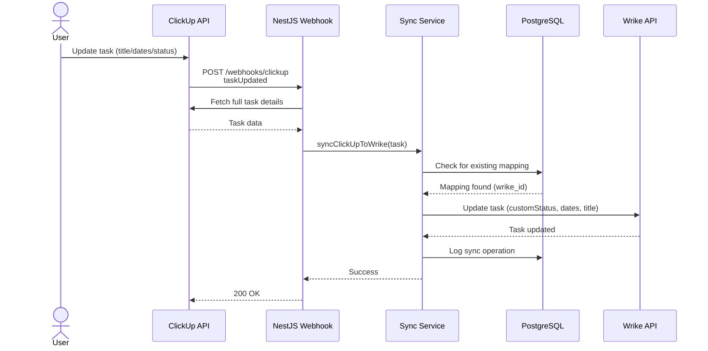
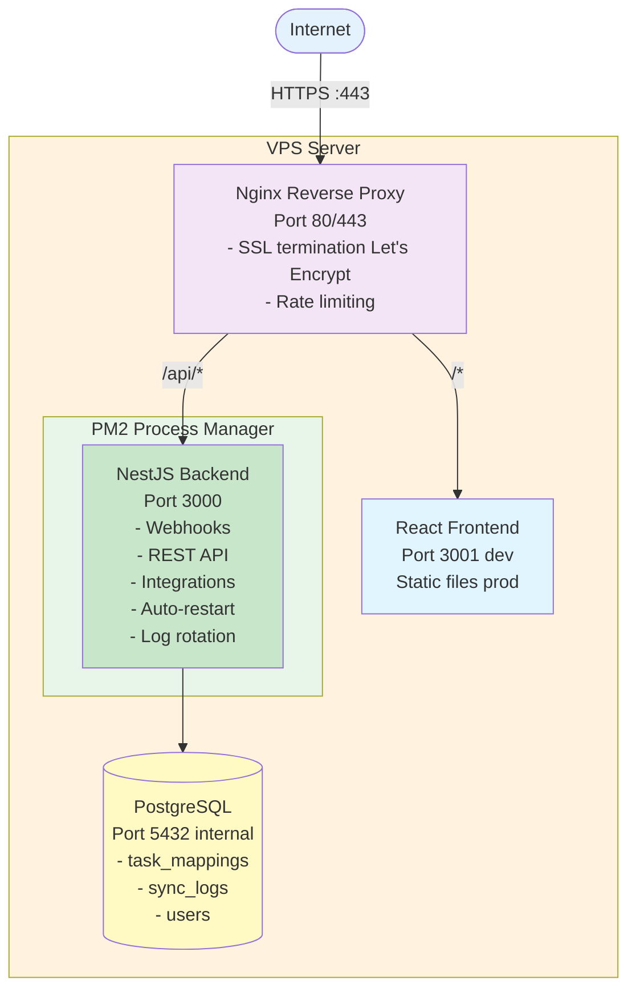

# Life Assistant - Design Documentation

## Implementation Status

**Last Updated:** January 2026

**Current Phase:** Phase 1 Complete, Phase 2 In Progress (Grocy Integration)

| Component | Status | Notes |
|-----------|--------|-------|
| **NestJS Backend** | ✅ Complete | Modular architecture with ConfigModule |
| **Database Module** | ✅ Complete | TypeORM entities for TaskMapping, SyncLog, User; migrations working |
| **Wrike Module** | ✅ Complete | API client, test endpoints, user ID caching, webhook management |
| **ClickUp Module** | ✅ Complete | API client, test endpoints, user ID caching, webhook management, tag operations |
| **Grocy Module** | ✅ Complete | Smart shopping list generator with homemade product resolution |
| **Webhooks Module** | ✅ Complete | Bidirectional event processing, tag-based loop prevention |
| **Sync Module** | ✅ Complete | Bidirectional sync: Wrike ↔ ClickUp with dates, status mapping, auto-assignment |
| **Auth Module** | ✅ Complete | JWT authentication with bcrypt password hashing |
| **React Frontend** | ✅ Complete | TanStack Router, shopping list page, webhook status page |
| **Staging Deployment** | ✅ Complete | Docker, CI/CD via GitHub Actions, deployed to staging environment |
| **Production Deployment** | ✅ Complete | Docker, deployed to production environment |

**Next Steps:**
1. Promote staging to production when ready
2. Create API Module for frontend (quick views, automation triggers)
3. Add React frontend for custom views and automation flows
4. Additional life automation modules (habits, etc.)

## Overview

A personal life automation platform that integrates productivity tools and enables custom automation workflows. The first module synchronizes work tasks from Wrike into ClickUp (personal task manager). Future modules will handle other life automation needs like meal prep scheduling, habit tracking, and custom quick-action triggers.

**Note:** The frontend is not meant to replace ClickUp for task management. ClickUp remains the primary task interface. The frontend will provide custom quick views and automation triggers (e.g., a button to create "defrost protein" + "cook dinner" task pairs).

Built with TypeScript, NestJS, PostgreSQL, and React for scalable multi-service deployment on a VPS.

## Problem Statement

- **Work tasks** are managed in Wrike (company requirement)
- **Personal productivity** is managed in ClickUp (personal preference)
- Need to maintain visibility across both platforms without manual duplication
- Changes in either platform should automatically reflect in the other
- **Future needs:**
  - Multiple integrations beyond Wrike-ClickUp (Jira, Asana, Notion, etc.)
  - Custom frontend for simplified task views and updates
  - User authentication for secure access
  - Analytics and reporting across all platforms

## Architecture

### High-Level Design



### Tech Stack Rationale

**TypeScript**
- Full type safety catches bugs at compile time
- Better IDE support and autocomplete
- Self-documenting code through types
- Easier refactoring and maintenance
- Shared types between frontend and backend

**NestJS (Backend Framework)**
- Built-in modular architecture (perfect for multiple integrations)
- Dependency injection for testability
- Decorators for clean, declarative code
- First-class TypeScript support
- Microservices-ready if needed later
- Built-in support for authentication, validation, scheduling
- TypeORM integration for type-safe database queries
- Extensive documentation and ecosystem

**PostgreSQL**
- Supports concurrent connections from multiple services
- ACID compliance for data integrity
- JSON/JSONB columns for flexible task metadata
- Full-text search capabilities
- Triggers and functions for complex logic
- Can scale from single VPS to distributed setup
- Free and open-source
- Production-proven reliability

**React (Frontend)**
- Component-based architecture
- Large ecosystem of UI libraries (Material-UI, Ant Design, etc.)
- Excellent developer experience with hot reload
- TypeScript support for type-safe frontend
- Can be deployed as static files (easy hosting)
- Server-side rendering possible with Next.js later

**PM2**
- Process management and auto-restart
- Built-in logging with rotation
- Zero-downtime restarts
- Resource monitoring
- Startup script generation

**VPS Deployment**
- Cost-effective (~$5-10/month vs $50+/month for serverless)
- Full control over resources
- No cold starts
- Predictable costs
- Can run 24/7

## Core Components

### 1. Wrike Module (`src/wrike/`)

**Implementation Status: ✅ Completed**

**WrikeService** (`wrike.service.ts`)
- Injectable NestJS service implementing OnModuleInit
- Wraps Wrike REST API v4
- **User ID Caching:**
  - Automatically fetches and caches current user ID on module initialization
  - `getCurrentUser()` - Fetch authenticated user contact information
  - `getCurrentUserId()` - Get cached user ID for task filtering
- **Task Methods:**
  - `getTask(taskId)` - Fetch specific task
  - `getTasksInFolder(folderId)` - List all tasks in folder
  - `getAllFolders()` - List all folders
  - `getCustomStatuses()` - Fetch custom workflow statuses
  - `createTask()`, `updateTask()` - (TODO: To be implemented)
- **Webhook Management:**
  - `createWebhook(hookUrl)` - Register a new webhook with Wrike
  - `listWebhooks()` - List all registered webhooks
  - `deleteWebhook(webhookId)` - Remove a webhook registration
- Handles authentication via Bearer token
- Returns typed responses using `WrikeApiResponse<T>` types

**WrikeController** (`wrike.controller.ts`)
- **Purpose:** Test/exploration and webhook management endpoints
- **Test Endpoints:**
  - `GET /wrike/test/statuses` - Fetch custom statuses
  - `GET /wrike/test/tasks` - List tasks in configured folder
  - `GET /wrike/test/task/:taskId` - Get specific task
  - `GET /wrike/test/folders` - List all folders
  - `GET /wrike/test/me` - Get current authenticated user info
- **Webhook Management Endpoints:**
  - `POST /wrike/webhooks/setup` - Auto-register webhook for current environment (supports ngrok)
  - `GET /wrike/webhooks` - List all registered webhooks
  - `DELETE /wrike/webhooks/:webhookId` - Delete a webhook
- Perfect for preview deployments and multi-environment setups

**WrikeModule** (`wrike.module.ts`)
- Exports WrikeService for use by other modules
- Imports ConfigModule for environment variables

### 2. ClickUp Module (`src/clickup/`)

**Implementation Status: ✅ Completed**

**ClickUpService** (`clickup.service.ts`)
- Injectable NestJS service implementing OnModuleInit
- Wraps ClickUp API v2
- **User ID Caching:**
  - Automatically fetches and caches current user ID on module initialization
  - `getAuthorizedUser()` - Fetch authenticated user information
  - `getCurrentUserId()` - Get cached user ID for auto-assignment
- **Task Methods:**
  - `getTask(taskId)` - Fetch specific task
  - `getTasksInList(listId)` - List all tasks in list
  - `getSpaces(workspaceId)` - List all spaces
  - `getList(listId)` - Get list details with statuses
  - `getListsInSpace(spaceId)` - List all lists in space
  - `createTask(listId, data)` - Create new task
  - `updateTask(taskId, data)` - Update existing task
  - `deleteTask(taskId)` - Delete a task
- **Webhook Management:**
  - `createWebhook(teamId, hookUrl)` - Register a new webhook with ClickUp
  - `listWebhooks(teamId)` - List all registered webhooks for a team
  - `deleteWebhook(webhookId)` - Remove a webhook registration
- Handles authentication via API token
- Returns typed responses using ClickUp API types

**ClickUpController** (`clickup.controller.ts`)
- **Purpose:** Test/exploration and webhook management endpoints
- **Test Endpoints:**
  - `GET /clickup/test/tasks` - List tasks in configured list
  - `GET /clickup/test/task/:taskId` - Get specific task
  - `GET /clickup/test/spaces` - List all spaces
  - `GET /clickup/test/list/:listId` - Get list details
  - `GET /clickup/test/lists/:spaceId` - List all lists in space
  - `POST /clickup/test/create-task` - Create test task
- **Webhook Management Endpoints:**
  - `POST /clickup/webhooks/:teamId/setup` - Auto-register webhook for current environment
  - `GET /clickup/webhooks/:teamId` - List all registered webhooks for team
  - `DELETE /clickup/webhooks/:webhookId` - Delete a webhook
- **Note:** Webhook event processing handled by WebhooksModule

**ClickUpModule** (`clickup.module.ts`)
- Exports ClickUpService for use by other modules
- Imports ConfigModule for environment variables

**Design Decision:** Each integration as a separate NestJS module
- Clear module boundaries
- Easy to add new integrations
- Modules can be tested in isolation
- Services are injectable and mockable

### 3. Grocy Module (`src/grocy/`)

**Implementation Status: ✅ Completed**

**GrocyService** (`grocy.service.ts`)
- Injectable NestJS service implementing OnModuleInit
- Wraps Grocy REST API
- **Core Methods:**
  - `getSystemInfo()` - Verify API connection
  - `getMealPlan()`, `getMealPlanForDateRange()` - Fetch meal plan data
  - `getMealPlanSections()` - Fetch meal plan sections (Breakfast, Lunch, etc.)
  - `getRecipes()`, `getRecipe(id)` - Fetch recipe data
  - `getRecipeIngredients()` - Fetch all recipe ingredients (`recipes_pos`)
  - `getRecipeNestings()` - Fetch included/nested recipes
  - `getStock()` - Fetch current stock levels
  - `getProducts()`, `getQuantityUnits()` - Fetch reference data
- **Smart Shopping List Methods:**
  - `generateSmartShoppingList(startDate, endDate)` - Main algorithm
  - `resolveRecipeIngredients()` - Recursive ingredient resolution
  - `buildHomemadeProductMap()` - Identify recipes that produce products
  - `addItemsToShoppingList()` - Add items to Grocy shopping list
  - `addMissingProductsToShoppingList()` - Add products below min stock
  - `updateShoppingListItemDone()` - Toggle item done status
  - `getHomemadeProducts()` - List all homemade products (debug)
- Handles authentication via GROCY-API-KEY header

**GrocyController** (`grocy.controller.ts`)
- **Protected Endpoints (require JWT):**
  - `GET /grocy/meal-plan/today` - Today's meals with recipe details and section names
  - `GET /grocy/meal-plan/date/:date` - Meals for specific date with section names
  - `GET /grocy/meal-plan/range/:start/:end` - Meals for date range with section names
  - `GET /grocy/shopping-list` - Current Grocy shopping list
  - `POST /grocy/shopping-list/generate` - Generate smart shopping list
  - `POST /grocy/shopping-list/add-items` - Add items to Grocy
  - `POST /grocy/shopping-list/add-missing-products` - Add products below min stock
  - `PATCH /grocy/shopping-list/items/:itemId` - Toggle item done status
  - `GET /grocy/recipes/:id/picture` - Proxy for recipe images
- **Test Endpoints (no auth):**
  - `GET /grocy/test/info` - System info
  - `GET /grocy/test/products`, `/stock`, `/recipes`, `/meal-plan`
  - `GET /grocy/test/shopping-list/:start/:end` - Test smart generation
  - `GET /grocy/test/homemade-products` - List homemade products
  - `GET /grocy/test/recipe-nestings` - List recipe nestings
  - `GET /grocy/test/recipes/:id/ingredients` - Recipe ingredients

**GrocyModule** (`grocy.module.ts`)
- Exports GrocyService for use by other modules
- Imports ConfigModule for environment variables

**Key Features:**
- Recursive resolution of homemade products to base ingredients
- Smart stock checking before resolving (uses existing stock first)
- Support for Grocy's "Included recipes" feature (nested recipes)
- Aggregated stock support (parent products with sub-products)
- Servings multiplier calculation for accurate quantities
- Meal plan sections with enriched responses (Breakfast, Lunch, Dinner, Meal Prep)
- Interactive shopping list (check/uncheck items syncs to Grocy)
- Restock low items (add products below min stock)

### 4. Database Module (`src/database/`)

**Implementation Status: ✅ Completed**

**Entities (TypeORM):**

```typescript
// task-mapping.entity.ts
@Entity('task_mappings')
export class TaskMapping {
  @PrimaryGeneratedColumn('uuid')
  id: string;

  @Column({ unique: true })
  wrike_id: string;

  @Column({ unique: true })
  clickup_id: string;

  @Column()
  integration_type: string; // 'wrike-clickup', 'jira-clickup', etc.

  @CreateDateColumn()
  created_at: Date;

  @UpdateDateColumn()
  updated_at: Date;

  @Index()
  @Column({ nullable: true })
  user_id: string; // For multi-user support
}

// sync-log.entity.ts
@Entity('sync_logs')
export class SyncLog {
  @PrimaryGeneratedColumn('uuid')
  id: string;

  @Column()
  source_platform: string;

  @Column()
  target_platform: string;

  @Column()
  source_task_id: string;

  @Column()
  target_task_id: string;

  @Column()
  action: string; // 'create', 'update', 'delete'

  @Column()
  status: string; // 'success', 'failed'

  @Column('text', { nullable: true })
  error_message: string;

  @CreateDateColumn()
  created_at: Date;
}

// user.entity.ts (for future multi-user support)
@Entity('users')
export class User {
  @PrimaryGeneratedColumn('uuid')
  id: string;

  @Column({ unique: true })
  email: string;

  @Column()
  password_hash: string;

  @Column({ nullable: true })
  wrike_token: string;

  @Column({ nullable: true })
  clickup_token: string;

  @CreateDateColumn()
  created_at: Date;
}
```

**DatabaseService** (`database.service.ts`)
- Injectable service wrapping TypeORM repositories
- Methods: `saveMapping()`, `getMapping()`, `findMappingByWrikeId()`, `findMappingByClickUpId()`
- Handles all database operations
- Returns typed entities

**DatabaseModule** (`database.module.ts`)
- Configures TypeORM connection
- Exports repositories for injection
- Handles migrations

**Design Decision:** TypeORM with PostgreSQL
- Type-safe database queries
- Automatic schema migrations
- Supports concurrent access from multiple services
- Can add indexes for performance
- Supports complex queries for analytics
- No in-memory cache needed (PostgreSQL is fast enough)

**Why PostgreSQL:**
- Multiple services can connect simultaneously (frontend + backend)
- Battle-tested for production workloads
- JSONB columns for flexible metadata storage
- Full-text search for task descriptions
- Can scale beyond single server if needed
- Free and open-source

### 4. Webhooks Module (`src/webhooks/`)

**Implementation Status: ✅ Implemented (Event Filtering & Sync Integration Complete)**

**WebhooksController** (`webhooks.controller.ts`)
- Centralized webhook endpoint handler
- Endpoints:
  - `POST /webhooks/wrike` - Receives Wrike webhook events
  - `POST /webhooks/clickup` - Receives ClickUp webhook events
- Logs all incoming webhook payloads and headers for debugging
- Delegates event processing to WebhooksService
- Returns success/error responses

**WebhooksService** (`webhooks.service.ts`)
- Processes incoming webhook events with intelligent event filtering
- **Wrike Webhook Processing (`handleWrikeWebhook`):**
  - Handles array of webhook events from Wrike
  - **Event Type Filtering** - Only processes:
    - `TaskResponsiblesAdded` - When user is assigned
    - `TaskResponsiblesRemoved` - When user is unassigned
    - `TaskStatusChanged` - Status updates
    - `TaskTitleChanged` - Title changes
    - `TaskDescriptionChanged` - Description updates
    - `TaskDatesChanged` - Due date changes
    - `TaskDeleted` - Task deletion
  - **Smart Assignment Filtering:**
    - For `TaskResponsiblesAdded`: Only syncs if current user in `addedResponsibles`
    - For `TaskResponsiblesRemoved`: Deletes from ClickUp if current user in `removedResponsibles`
    - For other events: Verifies task is still assigned to current user
  - **Deletion Handling:**
    - `TaskResponsiblesRemoved` → Deletes ClickUp task when unassigned
    - `TaskDeleted` → Deletes ClickUp task and mapping
  - Fully integrated with SyncService
- **ClickUp Webhook Processing (`handleClickUpWebhook`):**
  - Handles ClickUp webhook events for reverse sync
  - **Event Type Filtering** - Only processes:
    - `taskUpdated` - General task updates
    - `taskStatusUpdated` - Status changes
    - `taskDueDateUpdated` - Due date changes
    - `taskStartDateUpdated` - Start date changes
  - Fetches full task details from ClickUp API
  - Calls `syncService.syncClickUpToWrike()` for reverse sync
  - Fully integrated with SyncService

**WebhooksModule** (`webhooks.module.ts`)
- Exports WebhooksService
- Imports WrikeModule, ClickUpModule, and SyncModule for full bidirectional integration

**Design Decision:** Dedicated WebhooksModule
- Separates webhook handling from integration modules
- Wrike/ClickUp modules focus on API client logic
- WebhooksModule orchestrates sync operations
- Event-driven architecture with intelligent filtering
- Cleaner separation of concerns

**Event Filtering Strategy:**
- Prevents syncing irrelevant events (TaskCreated with null assignments)
- Only syncs when current user is actually assigned
- Handles deletion events for cleanup
- Avoids unnecessary API calls and database operations
- Solves timing issue with Wrike GUI (create → assign workflow)

### 5. Sync Module (`src/sync/`)

**Implementation Status: ✅ Fully Implemented (Bidirectional Sync Complete)**

**SyncService** (`sync.service.ts`)
- Injectable NestJS service
- Orchestrates bidirectional sync logic between platforms
- **Forward Sync Methods (Wrike → ClickUp):**
  - `syncWrikeToClickUp(wrikeTask)` - ✅ Sync Wrike task to ClickUp
  - `createClickUpTask(wrikeTask)` - ✅ Create new ClickUp task with auto-assignment
  - `updateClickUpTask(clickUpId, wrikeTask)` - ✅ Update existing ClickUp task with auto-assignment
  - `deleteTaskFromClickUp(wrikeTaskId)` - ✅ Delete ClickUp task and mapping
- **Reverse Sync Methods (ClickUp → Wrike):**
  - `syncClickUpToWrike(clickUpTask)` - ✅ Sync ClickUp task to Wrike
  - `updateWrikeTask(wrikeTaskId, clickUpTask)` - ✅ Update existing Wrike task
- **Status Mapping:**
  - `loadWrikeStatuses()` - ✅ Cache Wrike workflow statuses
  - `loadClickUpStatuses()` - ✅ Cache ClickUp list statuses
  - `mapWrikeStatusToClickUp(wrikeTask)` - ✅ Name-based status mapping (Wrike → ClickUp)
  - `mapClickUpStatusToWrike(clickUpTask)` - ✅ Name-based status mapping (ClickUp → Wrike)
- **Utility Methods:**
  - `logSync(data)` - ✅ Log sync operations to database
- **Future Enhancements:**
  - `manualSync()` - ❌ Manual trigger support (planned)
- Handles create, update, and delete operations based on webhook events
- Uses TypeORM repositories for TaskMapping and SyncLog entities
- Comprehensive error handling and logging

**Synced Fields (Wrike → ClickUp):**
- ✅ **Task Name** - Wrike title → ClickUp name
- ✅ **Description** - Wrike permalink → ClickUp description ("View in Wrike: [URL]")
- ✅ **Due Date** - Wrike dates.due (ISO) → ClickUp due_date (Unix timestamp ms)
- ✅ **Start Date** - Wrike dates.start (ISO) → ClickUp start_date (Unix timestamp ms)
- ✅ **Status** - Name-based mapping (case-insensitive)
  - In Progress → in progress
  - Completed → completed
  - On Hold → on hold
  - Cancelled → cancelled
  - etc.
- ✅ **Assignees** - Auto-assigned to authenticated ClickUp user (cached from `/user` endpoint)
- ✅ **Tags** - Auto-tagged with "touchbistro" and "from wrike"
- ❌ **Comments** - Not synced (future enhancement)
- ❌ **Attachments** - Not synced (future enhancement)
- ❌ **Priority** - Not synced (not used by org)
- ❌ **Custom Fields** - Not synced (not used by org)

**Synced Fields (ClickUp → Wrike):**
- ✅ **Task Name** - ClickUp name → Wrike title
- ✅ **Due Date** - ClickUp due_date (Unix timestamp ms) → Wrike dates.due (ISO)
- ✅ **Start Date** - ClickUp start_date (Unix timestamp ms) → Wrike dates.start (ISO)
- ✅ **Status** - Name-based reverse mapping (case-insensitive)
  - in progress → In Progress
  - completed → Completed
  - on hold → On Hold
  - etc.
  - **Note:** Uses `customStatus` parameter (not `customStatusId`)
- ❌ **Description** - Not synced (Wrike permalink is source of truth)
- ❌ **Assignees** - Not synced (Wrike task already assigned to user)
- ❌ **Tags** - Not synced (ClickUp-specific)
- ❌ **Comments** - Not synced (future enhancement)
- ❌ **Attachments** - Not synced (future enhancement)

**Status Mapping Strategy:**
- Caches Wrike workflows on first sync (customStatusId → status name)
- Caches ClickUp list statuses on first sync (lowercase name → actual name)
- **Forward (Wrike → ClickUp):** Maps Wrike customStatusId to status name, then matches to ClickUp (case-insensitive)
- **Reverse (ClickUp → Wrike):** Maps ClickUp status name to Wrike customStatusId (case-insensitive)
- Falls back gracefully if no match found (task still syncs without status)
- Logs all status mappings for debugging

**Important Technical Note - Wrike Status Parameter:**
- Wrike API uses `customStatus` (not `customStatusId`) for updating task status
- The parameter value is the custom status ID string
- Example: `{ customStatus: "IEAB4KN6JMALBIQW" }`
- Using the wrong parameter name (`customStatusId`) results in 400 error

**Requirement:** ClickUp statuses must match Wrike workflow names for mapping to work

**Design Philosophy:**
- ClickUp as personal workload tracker (not full Wrike replication)
- Wrike remains source of truth for project details
- Permalink enables quick navigation to full context
- Tags enable flexible filtering in ClickUp

**SyncModule** (`sync.module.ts`)
- Imports WrikeModule, ClickUpModule for API access
- Imports TypeORM entities (TaskMapping, SyncLog)
- Exports SyncService for use by WebhooksModule
- Integrated into WebhooksModule for automatic sync

**Implemented Sync Flows:**

**Forward Sync - Create/Update Flow (Wrike → ClickUp):**
1. ✅ Webhook receives Wrike event (TaskResponsiblesAdded, TaskStatusChanged, etc.)
2. ✅ Webhook service fetches full task details from Wrike API
3. ✅ Check database for existing Wrike → ClickUp mapping
4. ✅ If mapping exists → Update existing ClickUp task (with auto-assignment)
5. ✅ If no mapping → Create new ClickUp task, auto-assign to user, and save mapping
6. ✅ Log sync operation (success or failure) to sync_logs table
7. ✅ Return success/failure

**Forward Sync - Deletion Flow (Wrike → ClickUp):**
1. ✅ Webhook receives TaskResponsiblesRemoved or TaskDeleted event
2. ✅ For TaskResponsiblesRemoved: Check if current user was removed
3. ✅ Look up mapping to find ClickUp task ID
4. ✅ Delete ClickUp task via API
5. ✅ Remove mapping from task_mappings table
6. ✅ Log deletion operation to sync_logs table
7. ✅ Task removed from ClickUp

**Reverse Sync - Update Flow (ClickUp → Wrike):**
1. ✅ Webhook receives ClickUp event (taskUpdated, taskStatusUpdated, etc.)
2. ✅ Webhook service fetches full task details from ClickUp API
3. ✅ Check database for existing ClickUp → Wrike mapping
4. ✅ If mapping exists → Update existing Wrike task with new data
5. ✅ If no mapping → Skip (reverse sync only updates, doesn't create)
6. ✅ Log sync operation (success or failure) to sync_logs table
7. ✅ Return success/failure

**Tested & Verified:**
- ✅ **Forward Sync (Wrike → ClickUp):**
  - Create: Wrike task → ClickUp task with auto-assignment
  - Update: Title, dates, status changes sync to ClickUp
  - Delete: Unassign/delete in Wrike → removes from ClickUp
  - Mapping saved to task_mappings table
  - Sync logged to sync_logs table
  - Event filtering working (only assigned tasks sync)
- ✅ **Reverse Sync (ClickUp → Wrike):**
  - Update: Title changes sync from ClickUp to Wrike
  - Update: Date changes (due_date, start_date) sync correctly
  - Update: Status changes sync using correct `customStatus` parameter
  - Bidirectional sync working without loops
  - Reverse sync only updates (doesn't create new tasks)

**Design Decision:** Separate sync module
- Isolates business logic from API and presentation layers
- Injectable service can be used by webhooks and REST API
- Easier to test in isolation
- Can be reused across different integrations
- Database-backed for reliability and auditability

### 6. API Module (`src/api/`)

**Implementation Status: ❌ Not Yet Implemented**

**Purpose:** REST API for the React frontend

**ApiController** (`api.controller.ts`)
```typescript
// Task Management
GET    /api/tasks                 // List all synced tasks
GET    /api/tasks/:id             // Get specific task details
GET    /api/tasks/:id/status      // Get sync status
POST   /api/tasks/sync            // Manually trigger sync
DELETE /api/tasks/:id/mapping     // Remove task mapping

// Analytics
GET    /api/stats                 // Sync statistics
GET    /api/sync-logs             // Recent sync history
GET    /api/sync-logs/:id         // Specific sync log

// Integration Management
GET    /api/integrations          // List active integrations
GET    /api/integrations/:type/status // Integration health

// User Management (future)
GET    /api/user/profile          // Get user profile
PUT    /api/user/tokens           // Update API tokens
```

**AuthGuard**
- JWT-based authentication
- Validates tokens on all API endpoints
- Extracts user_id for multi-user support

**Design Decision:** Separate API module
- Clean separation between webhooks and REST endpoints
- Easy to version API (v1, v2, etc.)
- Can add rate limiting per user
- OpenAPI/Swagger documentation auto-generated

### 7. Status Mapping

**Implementation Status: ✅ Implemented (in SyncService)**

**Challenge:** Different status systems
- Wrike: Custom workflows with unique status IDs and names
- ClickUp: User-defined statuses per list

**Solution:** Name-based mapping with caching
- Maps Wrike customStatusId → status name → ClickUp status (case-insensitive)
- Caches both Wrike workflows and ClickUp list statuses on first use
- Graceful fallback if no match found

**Implementation:**
- `loadWrikeStatuses()` - Caches all Wrike workflow statuses
- `loadClickUpStatuses()` - Caches all ClickUp list statuses
- `mapWrikeStatusToClickUp()` - Performs name-based matching

**Mapping Examples:**
- "In Progress" (Wrike) → "in progress" (ClickUp)
- "Completed" (Wrike) → "completed" (ClickUp)
- "On Hold" (Wrike) → "on hold" (ClickUp)
- "Cancelled" (Wrike) → "cancelled" (ClickUp)

**Note:** Requires ClickUp statuses to match Wrike Default Workflow names

### 8. Configuration Module (`src/config/`)

**Implementation Status: ✅ Completed**

**Environment Variables:**
```bash
# Database
DATABASE_HOST=localhost
DATABASE_PORT=5432
DATABASE_USERNAME=postgres
DATABASE_PASSWORD=your_password
DATABASE_NAME=life_assistant

# Authentication
JWT_SECRET=your_jwt_secret
JWT_EXPIRATION=7d

# Wrike Integration
WRIKE_TOKEN=your_wrike_token
WRIKE_FOLDER_ID=folder_id_to_sync

# ClickUp Integration
CLICKUP_TOKEN=your_clickup_token
CLICKUP_WORKSPACE_ID=your_workspace_id_here
CLICKUP_LIST_ID=list_id_to_sync

# Server
PORT=3000
NODE_ENV=development
```

**ConfigService** (using @nestjs/config)
- Type-safe configuration access
- Validates all required variables on startup
- Supports .env files
- Can override with environment variables

**Design Decision:** NestJS ConfigModule
- Fails fast if configuration is missing
- Type-safe configuration getters
- Easy to test with different configs
- Supports multiple environments (dev, staging, prod)

### 9. Type Definitions (`src/*/types/`)

**Implementation Status: ✅ Partially Completed**

**Currently Implemented:**
- `src/wrike/types/wrike-api.types.ts` - Complete Wrike API response types (including WrikeContact for user info)
- `src/clickup/types/clickup-api.types.ts` - Complete ClickUp API response types
- `src/database/entities/*.entity.ts` - TypeORM entities with full type definitions

**Not Yet Implemented:**
- `task.types.ts` - Unified task DTOs
- `sync.types.ts` - Sync log DTOs
- `api.types.ts` - API request/response types
- `webhook.types.ts` - Webhook event payload types

**Current Type Coverage:**
- ✅ Wrike API responses (comprehensive)
- ✅ ClickUp API responses (comprehensive)
- ✅ Database entities (TypeORM)
- ❌ Webhook event payloads (using `any` currently)
- ❌ REST API endpoints
- ✅ Configuration (via NestJS ConfigModule)

**Design Decision:** Centralized types + DTOs
- Single source of truth
- Can be shared with frontend via npm package or monorepo
- Easy to update when APIs change
- Enables IntelliSense across entire codebase
- NestJS auto-validates DTOs with class-validator

## Webhook Flow

**Current Implementation:** Basic webhook reception with logging

### Wrike Webhook (`POST /webhooks/wrike`)

```typescript
@Controller('webhooks')
export class WebhooksController {
  @Post('wrike')
  @HttpCode(200)
  async wrikeWebhook(@Body() body: any, @Headers() headers: any) {
    this.logger.log('Wrike webhook received');
    this.logger.debug('Headers:', JSON.stringify(headers, null, 2));

    try {
      await this.webhooksService.handleWrikeWebhook(body);
      return { success: true };
    } catch (error) {
      this.logger.error('Error processing Wrike webhook:', error.message);
      throw error;
    }
  }
}
```

**TODO: Full Implementation Plan**
```typescript
async handleWrikeWebhook(payload: WrikeWebhookDto) {
  // 1. Validate webhook signature
  // 2. Extract taskId and eventType
  // 3. Filter for relevant events:
  //    - TaskCreated, TaskStatusChanged, TaskTitleChanged, TaskDescriptionChanged
  // 4. Check if event was triggered by sync bot (prevent loops)
  // 5. Call syncService.syncWrikeToClickUp(taskId)
  // 6. Return success response
}
```

### ClickUp Webhook (`POST /webhooks/clickup`)

```typescript
@Controller('webhooks')
export class WebhooksController {
  @Post('clickup')
  @HttpCode(200)
  async clickUpWebhook(@Body() body: any, @Headers() headers: any) {
    this.logger.log('ClickUp webhook received');
    this.logger.debug('Headers:', JSON.stringify(headers, null, 2));

    try {
      await this.webhooksService.handleClickUpWebhook(body);
      return { success: true };
    } catch (error) {
      this.logger.error('Error processing ClickUp webhook:', error.message);
      throw error;
    }
  }
}
```

**TODO: Full Implementation Plan**
```typescript
async handleClickUpWebhook(payload: ClickUpWebhookDto) {
  // 1. Validate webhook signature
  // 2. Extract task_id and event type
  // 3. Filter for relevant events:
  //    - taskCreated, taskUpdated, taskStatusUpdated
  // 4. Check if event was triggered by sync bot (prevent loops)
  // 5. Call syncService.syncClickUpToWrike(taskId)
  // 6. Return success response
}
```

## Data Flow

### Creating a Task (Wrike → ClickUp)



### Updating a Task (ClickUp → Wrike)



## Avoiding Sync Loops

**Problem:** Updates trigger webhooks, which trigger updates, creating infinite loops

**Solution:** Event filtering
- Track if event was triggered by the sync service
- Ignore events with `eventAuthorId === 'sync_bot'` (Wrike)
- Ignore events with `username === 'sync_bot'` (ClickUp)

**Note:** Currently relies on simple checks. Could be enhanced with:
- Tracking recent sync operations
- Adding sync metadata to task descriptions
- Implementing cooldown periods

## Error Handling

**API Failures:**
- Log error with context
- Return null from API methods
- Continue processing other events
- Don't crash the server

**Database Failures:**
- Log error
- Return false from operations
- Server continues running
- Mappings may be lost (but can be manually recreated)

**Webhook Processing:**
- Catch all errors in endpoint handlers
- Return 500 status with error message
- Log full error details
- Prevent server crashes

## Deployment Architecture



**Components:**
- **Nginx**: SSL termination, reverse proxy, static file serving, rate limiting
- **PM2**: Process management for NestJS, auto-restart, logging
- **NestJS**: Backend API server (webhooks + REST)
- **PostgreSQL**: Database server (local on VPS)
- **React**: Frontend (built to static files, served by Nginx)

## Performance Considerations

**Memory Usage:**
- NestJS process: ~100-150MB base
- PostgreSQL: ~50-100MB for small datasets
- PM2 overhead: ~10MB
- React build: Static files (~2-5MB)
- Total: ~200-300MB (fits comfortably in 1GB VPS)

**Response Times:**
- Webhook receipt: <10ms
- Database lookup (PostgreSQL): <5ms with indexes
- API calls to external services: 100-500ms (network dependent)
- Frontend API queries: 10-50ms (database + serialization)
- Total sync time: ~200-600ms per task

**Scalability:**
- Single VPS handles 1000s of tasks easily
- PostgreSQL can handle 100s of concurrent connections
- Can scale vertically (more RAM/CPU) or horizontally (add read replicas)
- Bottleneck is API rate limits, not server capacity
- Can handle ~60-100 syncs/minute (conservative estimate)

**Database Performance:**
- Indexes on wrike_id, clickup_id, user_id
- Connection pooling (TypeORM default: 10 connections)
- Query result caching for frequent reads
- Automatic vacuuming for PostgreSQL maintenance

## Security

**Authentication & Authorization:**
- JWT tokens for frontend authentication
- Tokens expire after configurable period (default: 7 days)
- Passwords hashed with bcrypt (12 rounds)
- API endpoints protected with AuthGuard
- Role-based access control (future: admin vs user)

**API Tokens:**
- External API tokens (Wrike, ClickUp) stored in environment variables
- User-specific tokens stored encrypted in database
- Never logged or exposed in API responses
- Not committed to version control

**Webhooks:**
- Webhook signature verification (HMAC-SHA256)
- IP whitelisting for known webhook sources
- Rate limiting to prevent abuse
- HTTPS required in production

**Database:**
- TypeORM prevents SQL injection (parameterized queries)
- Database user has minimal required permissions
- Password complexity requirements
- Regular automated backups
- Encryption at rest (future enhancement)

**Frontend Security:**
- CORS configured for specific origin
- XSS prevention (React auto-escapes by default)
- CSRF tokens for state-changing operations
- Secure cookie flags (httpOnly, secure, sameSite)
- Content Security Policy headers

**Network Security:**
- Nginx rate limiting (100 req/min per IP)
- Fail2ban for brute force protection
- SSL/TLS with modern cipher suites
- HSTS headers
- Database not exposed to public internet

## Cost Analysis

**Monthly Costs:**
- VPS (DigitalOcean/Vultr 1GB RAM): $6-12
  - Includes: NestJS backend, PostgreSQL, Nginx
- Domain (optional): ~$1/month
- SSL Certificate: Free (Let's Encrypt)
- Wrike API: Free
- ClickUp API: Free
- PostgreSQL: Free (self-hosted on VPS)
- Frontend hosting: Free (static files on same VPS)

**Total: $6-12/month**

**Recommended VPS Specs:**
- **Development:** 1GB RAM, 1 CPU, 25GB SSD ($6/month)
- **Production:** 2GB RAM, 1 CPU, 50GB SSD ($12/month)
  - Handles more concurrent users
  - Better PostgreSQL performance
  - Room for growth

**vs. Alternatives:**
- Zapier: $20-50/month for premium features
- Make.com: $9-29/month
- Custom serverless (AWS Lambda + RDS): $30-50/month
- Heroku (with Postgres addon): $25-50/month
- Vercel + Supabase: $25-40/month

**Cost Savings:**
- ~50-75% cheaper than managed alternatives
- No per-execution costs
- Unlimited webhook calls
- No database row limits

## Planned Features

### Task Insights Page (`/tasks`)

**Status:** Planned

**Purpose:** Surface patterns in task management behavior to help identify chronic procrastination and improve personal productivity.

#### MVP - Reschedule Leaderboard

A "wall of shame" showing tasks that keep getting pushed.

**Requirements:**
- New frontend route: `/tasks`
- Ranked list of tasks rescheduled 3+ times
- Sorted by reschedule count (highest first)
- Display: task name, current due date, reschedule count, tags
- ClickUp personal tasks only (excludes Wrike/work tasks)
- Excludes completed tasks

**Technical Investigation Needed:**
- [ ] Verify ClickUp API exposes task activity history (due date changes)
- [ ] If not available via API, design alternative approach (track changes ourselves)

**Data Requirements:**
- Task ID and name
- Current due date
- Number of times due date was changed
- Task tags (for pattern analysis)

**UI Mockup:**
```
Reschedule Leaderboard
━━━━━━━━━━━━━━━━━━━━━━━━━━━━━━━━━━━━━━━━━━━━━
#  Task                    Due        Pushes  Tags
1  Clean garage            Feb 15     12      [home] [weekend]
2  Schedule dentist        Feb 3      8       [health]
3  Review insurance        Jan 28     7       [admin] [finance]
4  Organize photos         Mar 1      5       [home]
5  Call mom                Feb 1      4       [family]
```

#### Future Enhancements (Roadmap)
- **Completed tasks view** - Celebrate tasks that finally got done after multiple reschedules ("Victory Lap")
- **Tag analysis** - Which categories of tasks get pushed most often
- **Time patterns** - Do certain days/weeks have more reschedules
- **Streak tracking** - How many days since last reschedule

---

### Shopping List Generator (`/shopping`)

**Status:** ✅ Implemented

**Purpose:** Generate accurate shopping lists from Grocy meal plans by calculating what ingredients are needed and subtracting current stock. Intelligently resolves "homemade" products to their base purchasable ingredients.

#### Features Implemented

**Core Functionality:**
- ✅ Accept a date range (start date, end date)
- ✅ Output list of products to buy with quantities
- ✅ Recursive resolution of homemade products to base ingredients
- ✅ Smart stock checking for homemade products before resolving
- ✅ Support for included/nested recipes (Grocy's "Included recipes" feature)
- ✅ Aggregated stock support (parent products accumulate sub-product stock)
- ✅ Add calculated items to Grocy's shopping list
- ✅ Restock low items (add products below minimum stock to shopping list)
- ✅ Interactive checkboxes to mark items done/undone (syncs to Grocy)
- ✅ Meal plan sections with color-coded badges (Breakfast, Lunch, Dinner, Meal Prep)

**Data Fetching:**
- ✅ Meal plan entries for the specified date range
- ✅ Meal plan sections for display labels (Breakfast, Lunch, etc.)
- ✅ All recipes (with `product_id` for homemade detection)
- ✅ Recipe ingredients (`recipes_pos` table)
- ✅ Recipe nestings (`recipes_nestings` table for included recipes)
- ✅ Current stock levels (using `amount_aggregated` for parent products)
- ✅ Products and quantity units for display

#### Smart Resolution Algorithm

The shopping list generator uses a recursive algorithm that:

1. **Processes each meal in the date range**
2. **For each recipe ingredient:**
   - If it's a **homemade product** (another recipe produces it):
     - Check if we have it in stock (`amount_aggregated`)
     - If **in stock**: use from stock, don't resolve to base ingredients
     - If **partially in stock**: use what's available, resolve the deficit
     - If **not in stock**: recursively resolve to base purchasable ingredients
   - If it's a **purchasable product**: add to the shopping list
3. **Processes included recipes** (nested recipes via `recipes_nestings`)
4. **Aggregates quantities** across all meals
5. **Subtracts stock** from needed amounts
6. **Returns only items** where `to_buy > 0`

**Example:**
- Recipe "Air Fryer Char Siu Chicken on Rice" uses "Char Siu Chicken" (homemade product)
- If Char Siu Chicken is in stock → use it, shopping list shows only rice
- If Char Siu Chicken is NOT in stock → resolve to chicken thighs, soy sauce, etc.

#### API Endpoints

| Endpoint | Method | Purpose |
|----------|--------|---------|
| `/grocy/shopping-list` | GET | Get current Grocy shopping list with enriched items |
| `/grocy/shopping-list/generate` | POST | Generate smart shopping list for date range |
| `/grocy/shopping-list/add-items` | POST | Add calculated items to Grocy shopping list |
| `/grocy/shopping-list/add-missing-products` | POST | Add products below min stock to shopping list |
| `/grocy/shopping-list/items/:itemId` | PATCH | Toggle shopping list item done status |
| `/grocy/meal-plan/today` | GET | Get today's meal plan with section names |
| `/grocy/meal-plan/date/:date` | GET | Get meal plan for specific date |
| `/grocy/meal-plan/range/:start/:end` | GET | Get meal plan for date range |
| `/grocy/test/shopping-list/:start/:end` | GET | Test endpoint (no auth) |
| `/grocy/test/homemade-products` | GET | List all homemade products |
| `/grocy/test/recipe-nestings` | GET | List all recipe nestings |
| `/grocy/test/recipes/:id/ingredients` | GET | Get recipe ingredients |

#### Response Format

```typescript
interface SmartGenerateShoppingListResponse {
  startDate: string;
  endDate: string;
  recipesProcessed: number;
  homemadeProductsResolved: number;  // Count of homemade products that needed resolution
  items: SmartShoppingListItem[];
}

interface SmartShoppingListItem {
  product_id: number;
  product_name: string;
  needed_amount: number;    // Total needed for all meals
  stock_amount: number;     // Current stock (aggregated)
  to_buy_amount: number;    // needed - stock
  qu_id: number;
  qu_name?: string;
}
```

#### Grocy API Endpoints Used

| Endpoint | Purpose |
|----------|---------|
| `GET /objects/meal_plan` | Meal plans with `day`, `recipe_id`, `recipe_servings`, `section_id` |
| `GET /objects/meal_plan_sections` | Meal plan sections (Breakfast, Lunch, etc.) |
| `GET /objects/recipes` | Recipes with `product_id`, `base_servings` |
| `GET /objects/recipes_pos` | Recipe ingredients |
| `GET /objects/recipes_nestings` | Included/nested recipes |
| `GET /objects/shopping_list` | Shopping list items with `done` status |
| `GET /stock` | Current stock with `amount` and `amount_aggregated` |
| `GET /objects/products` | Product details |
| `GET /objects/quantity_units` | Unit definitions |
| `POST /stock/shoppinglist/add-product` | Add item to Grocy shopping list |
| `POST /stock/shoppinglist/add-missing-products` | Add products below min stock |
| `PUT /objects/shopping_list/:id` | Update shopping list item (done status) |

#### Key Data Relationships

**Recipe → Product (homemade items):**
- If `recipe.product_id` is set, making that recipe produces that product
- Example: Recipe "Air Fryer Char Siu Chicken" (id:5) → produces Product "Char Siu Chicken" (id:157)
- Algorithm checks stock before resolving to base ingredients

**Recipe Nestings (included recipes):**
- `recipes_nestings.recipe_id` → parent recipe
- `recipes_nestings.includes_recipe_id` → included sub-recipe
- `recipes_nestings.servings` → how many servings of sub-recipe to include
- Example: "Buttered Bagel and Coffee" includes "Buttered Bagel" and "Cup of Coffee"

**Aggregated Stock:**
- `stock.amount` → direct stock of the product
- `stock.amount_aggregated` → includes stock from sub-products (parent product feature)
- Example: "Jasmine Rice" (generic) aggregates stock from "Dainty Jasmine Rice" (brand)
- Algorithm uses `amount_aggregated` when available

#### Technical Notes

- Circular dependency detection prevents infinite loops in nested recipes
- Homemade product stock is tracked across all meals to handle partial usage
- Servings multipliers are calculated from `meal.servings / recipe.base_servings`
- Only purchasable items appear in the final list (homemade products are resolved)

#### Weekly Meal Plan View

**Status:** ✅ Implemented

The meals page (`/meals`) provides a 7-day weekly view for meal planning with the following features:

**UI Components:**
- **WeekNavigation** - Navigate between weeks (prev/next/today buttons) with week range display
- **Weekly Grid** - 7-column grid on desktop (lg:grid-cols-7), stacked cards on mobile
- **MealCard** - Reusable component with two layouts:
  - `horizontal` (default) - Compact layout with 40x40px thumbnail
  - `stacked` - Full-width 16:9 aspect ratio image with stacked content
- **AddMealModal** - Modal for adding meals with recipe selection, section, and servings

**MealCard Features:**
- Section badge with color coding (Breakfast=amber, Lunch=green, Dinner=purple, Meal Prep=rose, Snack=cyan)
- Recipe image, name, and servings display
- Optional action buttons (all callbacks optional for reusability):
  - **Consume** - Deducts ingredients from Grocy stock
  - **Done** - Marks meal as done (visual only)
  - **Delete** - Removes meal from plan
- Done state visual (checkmark overlay, reduced opacity, strikethrough)
- Container queries for responsive button layout (`@container`, `@[180px]:flex-row`)

**Completion Tracking:**
- Uses Grocy's native `done` field (0 or 1) for persistence
- Also supports localStorage fallback for backward compatibility
- Done status syncs back to Grocy via `PATCH /grocy/meal-plan/:id/done`

**Date Utilities** (`date.utils.ts`):
- `getStartOfWeek(date)` - Returns Sunday of the week containing the date
- `getWeekDates(startDate)` - Returns array of 7 YYYY-MM-DD strings
- `formatWeekRange(startDate)` - Returns formatted range like "Jan 27 - Feb 2, 2026"

#### Meal Plan CRUD API

| Endpoint | Method | Purpose |
|----------|--------|---------|
| `/grocy/meal-plan` | POST | Create a new meal plan item |
| `/grocy/meal-plan/:id` | DELETE | Remove a meal plan item |
| `/grocy/meal-plan/:id/done` | PATCH | Update meal plan item done status |
| `/grocy/recipes/:recipeId/consume` | POST | Consume a recipe (deduct ingredients from stock) |
| `/grocy/recipes/selection` | GET | Get lightweight recipe list for dropdown |

**Recipe Selection Filtering:**
- Filters out internal Grocy meal plan entries:
  - Recipes with negative IDs (internal date entries)
  - Recipes with `type` starting with `mealplan-` (mealplan-day, mealplan-week, mealplan-shadow)
- Returns only real recipes for the dropdown

#### Meal Plan Sections

Grocy supports custom meal plan sections (Breakfast, Lunch, Dinner, Meal Prep, etc.). The API enriches meal plan responses with section names.

**Service Method:**
- `getMealPlanSections()` - Fetches all sections from `/objects/meal_plan_sections`

**Data Structure:**
```typescript
interface MealPlanSection {
  id: number;
  name: string | null;
  sort_number: number;
  time_info?: string | null;
}
```

**Enrichment:**
- Meal plan endpoints fetch sections in parallel with meals
- Each meal item includes `section_name` based on its `section_id`
- Frontend displays color-coded badges:
  - Breakfast → Amber
  - Lunch → Green
  - Dinner → Purple
  - Meal Prep → Rose
  - Snack → Cyan
  - Other → Blue (default)

#### Interactive Shopping List

Users can check/uncheck shopping list items directly from the frontend, syncing the done status to Grocy without adding items to stock.

**Service Method:**
- `updateShoppingListItemDone(itemId, done)` - Updates via `PUT /objects/shopping_list/:id`

**API Endpoint:**
```
PATCH /grocy/shopping-list/items/:itemId
Body: { done: boolean }
Response: { success: boolean }
```

**Frontend Behavior:**
- Clicking an unchecked item marks it done in Grocy
- Clicking a checked item marks it undone
- Local state updates immediately for responsiveness
- Items move between "To Buy" and "Done" sections

#### Restock Low Items

Replicates Grocy's "Add products that are below defined min. stock amount" feature.

**Service Method:**
- `addMissingProductsToShoppingList(listId?)` - Calls `POST /stock/shoppinglist/add-missing-products`

**API Endpoint:**
```
POST /grocy/shopping-list/add-missing-products
Body: { listId?: number }  // defaults to list 1
Response: { success: boolean }
```

**Frontend:**
- "Restock Low Items" button (amber colored) in shopping list header
- Adds all products below their defined minimum stock to the shopping list
- Refreshes shopping list after adding

#### Frontend Features

**Layout:**
- Two-column layout on desktop (meal plan left, shopping list right)
- Mobile-first: shopping list appears above meal plan on small screens
- Uses `flex-col-reverse lg:grid lg:grid-cols-2` for responsive behavior

**Generated Items Display:**
- Generated items appear in a distinct blue section ("From Meal Plan")
- Existing shopping list ("To Buy" / "Done") always visible below
- Prevents confusion when generating new items

**Visual Design:**
- Color-coded meal section badges
- Interactive checkboxes with hover effects
- Separate styling for generated vs existing items

#### Out of Scope

- Unit conversion between different measurement systems
- Price estimation
- Shopping location grouping

---

## Future Enhancements

### Phase 1: Task Sync Module (Complete)

**Backend Infrastructure:**
- ✅ NestJS architecture with modular design
- ✅ PostgreSQL database with TypeORM
- ✅ Docker Compose setup for development
- ✅ ConfigModule for environment variables
- ✅ Database entities (TaskMapping, SyncLog, User)
- ✅ CI/CD pipeline with GitHub Actions
- ✅ Staging deployment

**Integration Modules:**
- ✅ Wrike Module (API client, test endpoints, webhook management)
- ✅ ClickUp Module (API client, test endpoints, webhook management, tag operations)
- ✅ Comprehensive TypeScript type definitions for both APIs
- ✅ WebhooksModule (bidirectional event processing, loop prevention)
- ✅ SyncModule (bidirectional sync with status mapping, dates, auto-assignment)

**Not Yet Implemented:**
- ❌ API Module (REST API for frontend)
- ❌ Auth Module (JWT authentication)
- ❌ React frontend (custom quick views and automation triggers)
- ❌ DTO validation for webhook payloads

### Phase 2: Enhanced Sync Features
- Retry logic for failed API calls with exponential backoff
- Support for syncing comments between platforms
- Support for file attachments
- Sync subtasks/checklist items
- Selective sync based on tags/labels
- Conflict resolution UI (when task updated in both platforms)
- Bidirectional sync for due dates and assignees

### Phase 3: Additional Integrations
- Jira ↔ ClickUp sync
- Asana ↔ ClickUp sync
- Notion ↔ ClickUp sync
- Generic webhook integration for custom apps
- Integration marketplace/plugin system

### Phase 4: Advanced Features
- Multi-user support (each user has their own integrations)
- Role-based access control (admin, user, viewer)
- GraphQL API for more flexible queries
- Real-time sync status dashboard (WebSockets)
- Mobile app (React Native)
- Analytics and reporting (tasks created, sync success rate, etc.)
- Bulk operations (sync all tasks, reset mappings, etc.)
- Custom field mapping configuration
- Scheduled syncs (not just webhook-driven)

## Project Structure

**Current Implementation:**

```
life-assistant/
├── life-assistant-api/         # NestJS application (✅ Implemented)
│   ├── src/
│   │   ├── wrike/             # ✅ Wrike integration module
│   │   │   ├── wrike.service.ts
│   │   │   ├── wrike.controller.ts (test endpoints)
│   │   │   ├── wrike.module.ts
│   │   │   └── types/
│   │   │       └── wrike-api.types.ts
│   │   ├── clickup/           # ✅ ClickUp integration module
│   │   │   ├── clickup.service.ts
│   │   │   ├── clickup.controller.ts (test endpoints)
│   │   │   ├── clickup.module.ts
│   │   │   └── types/
│   │   │       └── clickup-api.types.ts
│   │   ├── grocy/             # ✅ Grocy integration module
│   │   │   ├── grocy.service.ts
│   │   │   ├── grocy.controller.ts
│   │   │   ├── grocy.module.ts
│   │   │   └── grocy.types.ts
│   │   ├── webhooks/          # ✅ Webhooks module
│   │   │   ├── webhooks.controller.ts
│   │   │   ├── webhooks.service.ts
│   │   │   └── webhooks.module.ts
│   │   ├── database/          # ✅ Database entities & module
│   │   │   ├── entities/
│   │   │   │   ├── task-mapping.entity.ts
│   │   │   │   ├── sync-log.entity.ts
│   │   │   │   └── user.entity.ts
│   │   │   ├── migrations/
│   │   │   ├── database.service.ts
│   │   │   └── database.module.ts
│   │   ├── sync/              # ✅ Sync module
│   │   │   ├── sync.service.ts
│   │   │   └── sync.module.ts
│   │   ├── auth/              # ✅ Auth module
│   │   │   ├── auth.service.ts
│   │   │   ├── auth.controller.ts
│   │   │   ├── auth.module.ts
│   │   │   ├── guards/
│   │   │   │   └── jwt-auth.guard.ts
│   │   │   └── strategies/
│   │   │       └── jwt.strategy.ts
│   │   ├── app.controller.ts
│   │   ├── app.service.ts
│   │   ├── app.module.ts
│   │   └── main.ts
│   ├── .env.example
│   ├── Dockerfile
│   ├── package.json
│   └── tsconfig.json
│
├── life-assistant-frontend/    # ✅ React frontend
│   ├── src/
│   │   ├── components/
│   │   │   └── ProtectedRoute.tsx
│   │   ├── contexts/
│   │   │   └── AuthContext.tsx
│   │   ├── routes/            # TanStack Router file-based routes
│   │   │   ├── index.tsx      # Home page
│   │   │   ├── login.tsx      # Login page
│   │   │   ├── shopping.tsx   # Shopping list generator
│   │   │   └── webhooks.tsx   # Webhook status
│   │   ├── lib/
│   │   │   └── api.ts         # Axios API client
│   │   ├── App.tsx
│   │   └── main.tsx
│   ├── public/
│   ├── Dockerfile
│   ├── package.json
│   └── tsconfig.json
│
├── deployment/                 # Docker Compose for prod/staging
├── DESIGN.md                   # Architecture documentation
├── CLAUDE.md                   # Claude Code context
├── docker-compose.yml          # ✅ Development environment
└── README.md
```

**Key Differences from Original Design:**
1. **WebhooksModule added** - Centralized webhook handling (not in original design)
2. **Test endpoints** - Wrike/ClickUp controllers have test endpoints for API exploration
3. **Type organization** - Types are in module-specific folders (`wrike/types/`, `clickup/types/`)
4. **No common/types yet** - Will be added when implementing sync logic
5. **No frontend yet** - Backend-first implementation approach

## Testing Strategy

**Unit Tests (Jest + NestJS Testing):**
- Service methods (WrikeService, ClickUpService, SyncService)
  - Mock external API calls with axios-mock-adapter
  - Test error handling and retries
- Status mapping functions
- Database operations (using in-memory SQLite for tests)
- Authentication logic (JWT generation, validation)
- DTOs validation with class-validator

**Integration Tests:**
- Webhook endpoints (with realistic payloads)
  - Test Wrike webhook handling
  - Test ClickUp webhook handling
  - Test loop prevention
- API endpoints (with supertest)
  - Test authentication flow
  - Test task queries
  - Test manual sync triggers
- Full sync flow (end-to-end)
  - Use test API endpoints (mock servers)
  - Verify database state after sync

**E2E Tests (Frontend + Backend):**
- User login flow
- Task list display
- Manual sync trigger from UI
- Real-time sync status updates

**Manual Testing:**
- Create test tasks in Wrike → Verify in ClickUp
- Create test tasks in ClickUp → Verify in Wrike
- Update tasks in both platforms
- Test edge cases:
  - Long descriptions
  - Special characters
  - Multiple rapid updates
  - Network failures
  - Invalid tokens

**Test Coverage Goals:**
- Services: >80%
- Controllers: >70%
- Overall: >75%

## Monitoring & Maintenance

**Health Checks:**
- `GET /health` endpoint (NestJS TerminusModule)
  - Database connectivity
  - Memory usage
  - Disk space
  - Uptime
  - Last successful sync time
- Can be monitored by UptimeRobot, Pingdom, Better Uptime, etc.

**Logging:**
- NestJS built-in logger with custom formatting
- PM2 captures stdout/stderr
- Winston for structured logging (JSON format)
- Log levels: error, warn, info, debug
- Logs stored in `/var/log/life-assistant/`
- Automatic rotation via pm2-logrotate
- Retention: 7 days of detailed logs, 30 days of error logs

**Backups:**
- PostgreSQL automated backups via cron
  ```bash
  # Daily backup at 2 AM
  0 2 * * * pg_dump life_assistant > /backups/db_$(date +\%Y\%m\%d).sql
  ```
- Keep 7 days of daily backups
- Weekly backups retained for 30 days
- Backup to cloud storage (S3, Backblaze, etc.) for redundancy

**Metrics to Monitor:**
- Server uptime and availability
- API response times (p50, p95, p99)
- Webhook processing times
- Error rates (4xx, 5xx)
- Database query performance
- Database size and growth rate
- Memory usage and trends
- CPU usage
- Sync success/failure rates
- External API rate limit usage

**Alerting:**
- Server down for >5 minutes
- Error rate >5% over 10 minutes
- Database size >80% of disk
- Memory usage >90%
- Sync failures >10 in an hour
- External API errors (token expiration, rate limits)

## Design Decisions Summary

| Decision | Rationale |
|----------|-----------|
| **TypeScript** over JavaScript | Type safety, shared types between frontend/backend, better tooling |
| **NestJS** over Express | Built-in modularity, DI, microservices-ready, extensive ecosystem |
| **PostgreSQL** over SQLite | Multi-service access, scalability, better for production workloads |
| **TypeORM** over raw SQL | Type-safe queries, auto-migrations, entity modeling |
| **React** for frontend | Large ecosystem, TypeScript support, component reusability |
| **JWT** for auth | Stateless, scalable, standard for SPAs |
| **VPS** over Serverless | Cost-effective ($6-12 vs $30-50/mo), no cold starts, full control |
| **Webhooks** over Polling | Real-time, efficient, event-driven architecture |
| **Modular architecture** | Each integration is a module, easy to add new platforms |
| **Dedicated WebhooksModule** | Separates webhook handling from integration logic (implemented) |
| **Test endpoints** | Integration modules have test endpoints for API exploration |
| **PM2** over systemd | Easier management, built-in logging and monitoring |
| **Nginx** reverse proxy | SSL termination, static file serving, rate limiting |
| **Monorepo structure** | Shared types, unified versioning, simpler deployment |

## Conclusion

This design prioritizes:
- **Scalability** - Built with NestJS modules, easy to add new integrations
- **Maintainability** - Type-safe, well-structured, testable code
- **Cost-effectiveness** - $6-12/month VPS vs $30-50/month for managed alternatives
- **Extensibility** - Modular architecture allows adding features without rewrites
- **Production-ready** - Proper authentication, logging, monitoring, backups
- **User experience** - Custom React frontend for simplified task management
- **Type safety** - End-to-end TypeScript across frontend, backend, and database

The architecture starts with a solid foundation (NestJS + PostgreSQL) that can scale from a single integration to a full-featured task management platform with multiple integrations, users, and advanced features.

**Implementation Progress (as of January 2026):**
- ✅ Backend foundation complete (NestJS, PostgreSQL, TypeORM)
- ✅ Integration modules complete (Wrike, ClickUp with comprehensive API clients)
- ✅ User ID caching for both platforms (auto-assignment support)
- ✅ Webhooks infrastructure complete (bidirectional event processing)
- ✅ Sync logic complete (bidirectional sync with dates, status, auto-assignment)
- ✅ Tag-based sync loop prevention
- ✅ Staging deployment complete (CI/CD via GitHub Actions)
- ⏳ Production deployment pending (infrastructure ready)
- 📋 Frontend planned (custom quick views and automation triggers)

**Key advantages over initial Express + SQLite design:**
- ✅ Multi-service support (frontend can query database)
- ✅ Better scalability (PostgreSQL handles concurrent connections)
- ✅ Easier to test (dependency injection, mocking)
- ✅ Faster development (NestJS CLI, decorators, auto-validation)
- ✅ Better developer experience (IntelliSense, type safety everywhere)
- ✅ Production-ready from day one (authentication, proper logging)

**Architectural Refinements During Implementation:**
- ✅ Separated webhook handling into dedicated WebhooksModule
- ✅ Added test endpoints to integration modules for API exploration
- ✅ Organized types within module directories for better encapsulation
- ✅ Used comprehensive TypeScript types for external APIs (Wrike, ClickUp)

**When to scale:**
- Add read replicas if database becomes bottleneck (>1000 users)
- Extract integration modules to separate microservices if needed
- Add Redis for caching and session management at scale
- Consider managed database (RDS, Supabase) if ops burden increases

This architecture avoids premature optimization while building on solid foundations that won't require major rewrites as the platform grows.
